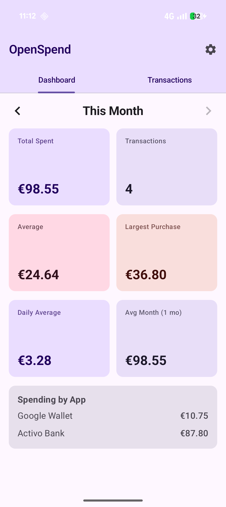
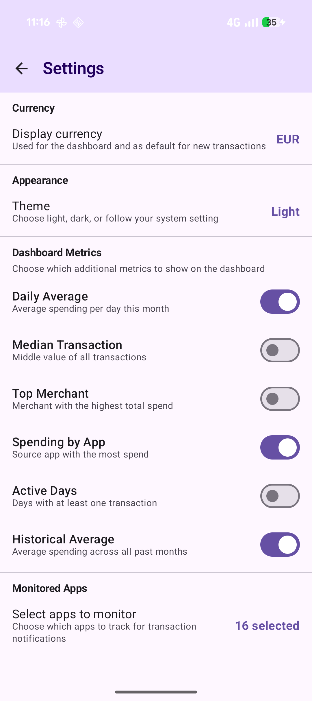

# Spendings App

A **fully local, private** Android spending tracker that automatically reads your bank and payment app notifications to track expenses — **no accounts, no APIs, no internet required**.

Your financial data never leaves your device.

## How It Works

1. **Grant notification access** — the app asks for permission to read notifications (the only permission it needs).
2. **Spend as usual** — when you get a notification from your bank or payment app, the app silently parses the amount, merchant, and currency.
3. **Check your dashboard** — see your monthly stats at a glance: total spent, number of transactions, average spend, and largest purchase.

That's it. No manual entry, no bank logins, no cloud sync.

## Features

- **Automatic tracking** — passively reads notifications from 18+ financial apps (Chase, Wells Fargo, Bank of America, PayPal, Venmo, Cash App, Google Pay, Revolut, PhonePe, and more).
- **Smart parsing** — regex-based engine with confidence scoring extracts amounts, currencies, and merchants from notification text. Supports US and EU number formats.
- **Multi-currency** — recognizes 12 currency symbols (`$ € £ ¥ ₹` …) and 19 ISO codes.
- **Deduplication** — SHA-256 hashing prevents duplicate transactions.
- **Transaction list** — swipe right from the dashboard to see all transactions for the current month. Long-press any entry to delete it if it doesn't make sense.
- **100% offline** — no internet permission, no API calls, no telemetry. Zero network access.
- **Privacy first** — raw notification text is never stored. Only structured data (amount, merchant, currency, timestamp) is saved locally.

## Requirements

- Android 9+ (API 28)
- Notification access permission (granted manually in Settings)

## Getting Started

Install the app, open and tap **Enable** on the notification access prompt. The app will start tracking automatically.

## Privacy

- **No internet permission** — the app literally cannot connect to the network.
- **No accounts** — nothing to sign up for.
- **No analytics or telemetry** — zero tracking.
- **Local-only storage** — all data lives in an on-device SQLite database.
- **Notification text is discarded** — only the parsed amount, merchant, currency, and timestamp are kept.

## FAQ

**Why is this only available on Android?**  
iOS does not allow apps to read notifications from other apps, making the automatic tracking that powers this app impossible on Apple devices.
